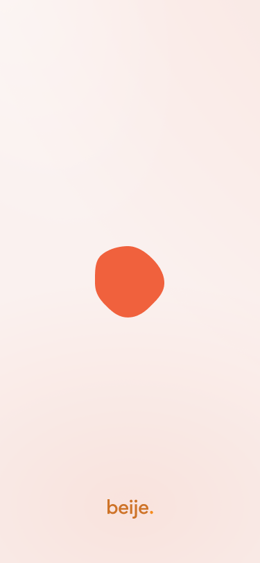
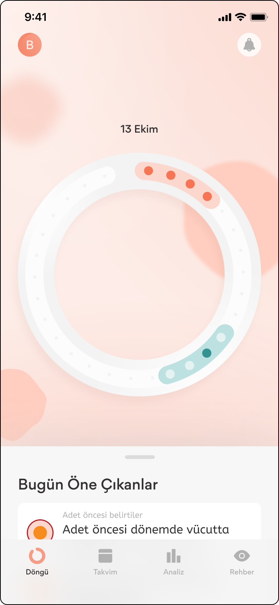
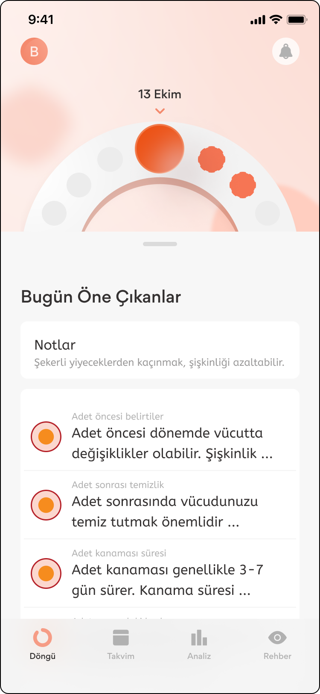

# 📱 **beije Cycle App - Mobile Assignment** 

## 📌 **Proje Hakkında**
Bu proje, **beije mobil geliştirme görevi** kapsamında geliştirilmiştir.  
Uygulama, **menstrüel döngüyü takip eden ve öngörüleri (insights) içeren iki ana ekran** içermektedir:

1. **Splash Screen**:
    - Kullanıcı girişini kontrol eder.
    - API'den verileri çeker ve Redux’a kaydeder.
    - Kullanıcı animasyonu en az **üç kez** izlemeden geçemez.

2. **Cycle Screen**:
    - Regl döngüsünü **yay (arc) içinde noktalarla** gösterir.
    - Günler farklı renklerde noktalarla temsil edilir.
    - Alt sayfa (bottom sheet) açıldığında animasyonlarla geçiş yapılır.

---

## 🛠 **Kullanılan Teknolojiler**
| Paket | Versiyon |
|--------|----------|
| `react-native` | 0.76.7 |
| `expo` | ~52.0.35 |
| `react-redux` | ^9.2.0 |
| `@reduxjs/toolkit` | ^2.5.1 |
| `axios` | ^1.7.9 |
| `lottie-react-native` | 7.1.0 |
| `react-native-reanimated` | ^3.16.2 |
| `react-native-gesture-handler` | ~2.20.2 |
| `react-native-svg` | ^15.11.1 |
| `nativewind` | ^4.1.23 |
| `@expo/vector-icons` | ^14.0.2 |
| `@gorhom/bottom-sheet` | ^5.1.1 |
| `react-native-dotenv` | ^3.4.11 |

---

## 🔧 **Kurulum ve Çalıştırma**

### 📥 **Projeyi İndirme**

```bash
git clone https://github.com/mogretici/beijeApp.git
cd beijeApp
```

### 1️⃣ **Gerekli Bağımlılıkları Yükleyin**

```bash
npm install
# veya
yarn install
```

### 2️⃣ Çevresel Değişkenleri Ayarlayın

Projede çevresel değişkenleri yönetmek için **.env** dosyası kullanılır.

📌 Öncelikle .env.example dosyasını .env olarak kopyalayın:

```bash
cp .env.example .env
```
Ardından .env dosyanızı düzenleyin ve **kendinize ait bilgileri** girin:

```bash
EXPO_PUBLIC_PRODUCTION_URL=paste_your_production_url_here
EXPO_PUBLIC_EMAIL=paste_your_email_here
EXPO_PUBLIC_PASSWORD=paste_your_password_here
```

### ▶️ Uygulamayı Çalıştırma

#### Expo Prebuild (Eject)

Expo ortamında çalışırken **prebuild** yapmak için aşağıdaki komutu çalıştırın:

```bash
npx expo prebuild
```

Bu işlem, projeyi tamamen native bir React Native projesine dönüştürür.

#### Android’de Çalıştırma

Android cihazda veya emülatörde çalıştırmak için:

```bash
npx expo run:android
```

📌 Android Studio Emulator veya fiziksel bir cihazda çalıştırabilirsiniz.

#### iOS’ta Çalıştırma

iOS cihazda veya simülatörde çalıştırmak için:

```bash
npx expo run:ios
```

📌 **UYARI: iOS uygulamasını çalıştırmadan önce, bağımlılıkları yüklemeniz gerekir:**

```bash
cd ios
pod install
cd ..
```

⚠️ **iOS yalnızca macOS işletim sisteminde çalışır. Eğer macOS kullanmıyorsanız, iOS için uygulamayı çalıştıramazsınız.**

## 📦 APK Dosyası

📌 Projeye ait güncel APK dosyası, **ana dizindeki apk/ klasörü** altında bulunmaktadır.
Bu dosyayı, test etmek veya bir cihaza yüklemek için kullanabilirsiniz.

## 🎨 Ekran Görüntüleri

<p align="center">
  
  
  
</p>

## 🧪 **Test Edilen Cihazlar**

📱 **Android**:
- **Samsung Galaxy S21 Ultra** (Android 14)
- **Samsung Galaxy M31** (Android 12)
- **Android Studio Emulator** Pixel 6a API 33 (Android 13)

📱 **iOS**:
- **iPhone 12** Expo Go (iOS 18.3.1)
- **iPhone 16 Plus** (iOS 18.0)


## 💡 **Önemli Notlar**
Eğer projeyle ilgili bir hata alırsanız, aşağıdaki adımları kontrol edin:

	•	.env dosyanızın doğru doldurulduğundan emin olun.
	•	Expo prebuild yaptınız mı? (npx expo prebuild)
	•	iOS’ta pod install yaptınız mı? (cd ios && pod install && cd ..)
	•	Android için Expo Go yerine native çalışma ortamı kullanılıyor mu? (npx expo run:android)

### 📩 Herhangi bir sorunuz veya öneriniz varsa, benimle aşağıdaki kanallardan iletişime geçebilirsiniz.
<p align="center">
  <a href="https://www.linkedin.com/in/mogretici/" target="_blank">
    
  </a>
  <a href="https://github.com/mogretici" target="_blank">
    
  </a>
  <a href="mailto:lutfuogretici@gmail.com">
    
  </a>
</p>